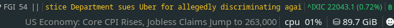

# I3 News [](LICENSE) [](Zig-0.14.1)

<br/><br/

<br/><br/>

<br/><br/>


__I3 News__ let's you create interactive news headline snippets compatible with various i3/sway bar plugins, based on user defined RSS/Atom feeds. 

Compatibility list:

- i3blocks
- polybar
- i3status
- waybar
 
#### Table of Contents
<!--toc:start-->
- [Installation](#installation)
    - [Building from source](#building-from-source)
- [Usage](#usage)
    - [i3blocks](#i3blocks)
    - [i3status](#i3status)
    - [Polybar](#polybar)
    - [Waybar](#waybar)
- [Scrolling headlines](#scrolling-text-headlines)
    - [Polybar/Waybar](#polybarwaybar)
    - [i3blocks](#i3blocks-1)
- [Configuration](#configuration)
<!--toc:end-->
### Installation
> [!NOTE]
> i3 news requires `fuse`/`libfuse` libraries installed in the system

I3 news ships with 2 versions available:

- __Light__ - Includes only i3 news binary and supplementary scripts, it does not contain [Newsboat](https://newsboat.org/) RSS reader required for retrieval of RSS data, you will need to install Newsboat package system wide (Note: Snapcraft version is not supported) (__Recommended__)
 
 
To install this version execute:
``` bash
sh -c "$(curl -fsSL https://raw.githubusercontent.com/exaroth/i3-news/master/install.sh)"
```
- __Self Contained__  - this is the same as above but ships with Newsboat app and all required shared libraries included. To install run:
 
``` bash
sh -c "$(curl -fsSL https://raw.githubusercontent.com/exaroth/i3-news/master/install_full.sh)"
```

You can also download `i3_news` executables from [releases](https://github.com/exaroth/i3-news/releases) page.

Following the installation update your crontab to set up regular RSS feed reloads , eg to update feeds every 20 minutes:


`crontab -e`

``` crontab
*/20 * * * * /usr/local/bin/i3_news reload
```
 
#### Building from source

__Note__: Supported zig versions - `0.14.1`/`0.15.0`

Clone the repository and run `make build-appimage` to compile the source and build AppImage for the executable.

### Usage

```
Usage: i3news ?<command> <options>

Commands: open|reload|ticker|scroll|paginate|version

Options:
  -c, --configs       Snippet configuration or configurations to use
  -s, --i3status      I3status output
  -b, --i3blocks      I3blocks output
  -p, --polybar       Polybar output
  -w, --waybar        Waybar output
  -a, --add-config    Add new i3-news configuration
  -r, --rm-config     Remove existing configuration
  -e, --edit-config   Edit urls for given configuration
      --get-url       Retrieve url for currently displayed headline
      --plain         Plain output
      --random        Retrieve headlines using random strategy
      --latest        Retrieve headlines prioritising latest articles
      --debug         Print debug info
  -h, --help          Print help
```

### Creating new snippet

In order to create new I3 news snippet execute:

``` sh
i3_news -a <snippet_name>
```

You will be prompted to enter list of RSS/Atom urls which will be tracked by the snippet.

Use 
```
i3_news -e <snippet_name>
```
To edit snippet urls, or
```
i3_news -r <snippet_name>
```
to remove existing one.

Snippet configurations are stored at `$HOME/.config/i3_news/`.

### Integration with i3 bar plugins.

#### Static headllines

#### i3blocks
In order to add i3 news snippet to i3blocks bar edit existing configuration (typically stored at `~/.i3blocks`) adding following entry:

```
[News]
command=/usr/local/bin/i3_news -b -c <snippet_name>
interval=30
```
(`interval` value will determine how often headlines will be refreshed)

Additionally in order to customize browser command to use when opening headline url you can use `I3_NEWS_BROWSER_CMD` env variable, for example to open url in new firefox tab use:

```
command=I3_NEWS_BROWSER_CMD="/usr/bin/firefox --new-tab" /usr/local/bin/i3_news -b -c <snippet_name>
```

#### i3status

> [!NOTE]
> i3status plugin is non-interactive, thus clicking on headline wont result in opening of the url in the browser
 
Edit `i3` configuration (typically stored at `~/.config/i3/config`) and locate `bar { ... }` block containing
```
status_command  i3status
```

entry, replace it with:

```
status_command  i3status | /usr/local/bin/i3_news -s -c <snippet_name>
```

You can also output more than 1 snippet by passing comma delimited list of snippet names as part of `-c` parameter.

#### polybar

Edit polybar configuration file (usually stored at `~/.config/polybar/config.ini`), add following entry:

``` ini
    [module/i3-news]
    type = custom/script
    exec = /usr/local/bin/i3_news -p -c <snippet_name>
    tail = true
    interval = 10
    click-left = /usr/local/bin/i3_news open -c <snippet_name>
```
then update either `modules-left` or `modules-right` entry with `i3-news`.

Similarly to `i3blocks` integration you can customize browser used for opening headline urls by adding `I3_NEWS_BROWSER_CMD` env when executing `click-left` handler.


#### waybar

Edit waybar configuraton (typically stored at `~/.config/waybar/config`), add following entry

``` json
    "custom/i3-news": {
        "exec": "/usr/local/bin/i3_news -w -c <snippet_name>",
        "return-type": "json",
        "interval": 10,
        "tooltip": false,
        "on-click": "/usr/local/bin/i3_news open -c <snippet_name>"
    }
```

and update `modules-right`, `modules-left` or `modules-center` with `custom/i3-news` entry.

You can customize color rendering by editing `~/.config/waybar/style.css` and adding

``` css
#custom-i3-news.<snippet_name> {
    color: white;
}
```

### Headline ticker, scroll and paginate commands

__I3 News__ ships supplied with commands for outputting dynamic text headlines, these are useful particularly if your bar setup requires constant widget width. Dynamic headlines are not available for `i3status` integration.

Available commands:

#### ticker
<br/><br/>

`ticker` command will output infinite feed of scrolling headlines, new headlines will be retrieved and inserted automatically.

#### scroll
<br/><br/>

`scroll` command will scroll single headline if it exceeds widget width, otherwise it will output static text.

#### paginate
<br/><br/>

`paginate` command will split text into multiple pages if it exceeds widget width, otherwise headline text will be displayed as is.

#### Usage

Usage for dynamic headline commands is as simple as calling:

```
i3_news <command> -c <snippet_name>
```
where `<command>` is `ticker`/`scroll`/`paginate`, you can also pass arguments which modify headline retrieval strategy such as `--latest` or `--random`


##### I3blocks integration

Example usage in i3blocks config (`markup=pango` and `interval=persist` settings are required), also pass `I3_NEWS_OUTPUT_PANGO` env variable to ensure that output text is rendered with monospace font which ensures proper rendering of the text.

```
[NEWS]
command=I3_NEWS_OUTPUT_PANGO=1 /usr/local/bin/i3_news <ticker/scroll/paginate> -c <snippet_name>
markup=pango
color=#FEC925
interval=persist
```


##### Polybar integration

Reference configuration, note there's no need to include `interval` field for scrolling snippets.
```
    [module/i3-news-scroll]
    type = custom/script
    exec = /usr/local/bin/i3_news <ticker/scroll/paginate> -c <snippet_name>
    click-left = /usr/local/bin/i3_news open -c <snippet_name>
    tail = true
```

##### Waybar integration

``` json
    "custom/i3-news-scroll": {
        "escape": "true",
        "exec": "/usr/local/bin/i3_news <ticker/scroll/paginate> -c <snippet_name>",
        "max-length": 50,
        "min-length": 50,
        "on-click": "/usr/local/bin/i3_news open -c <snippet_name>"
    }
```

#### Dynamic headline options

Dynamic headlines can be configured by passing various env vars to `i3_news` executable , most straightforward way to do it is to pass them as a prefix when calling the executable, eg.

``` bash
ENV_VAR=val `i3_news` <args>
```
Available settings:

- `I3_NEWS_INTERVAL` - (`scroll`/`paginate` only) Defines how often to swap headlines (in seconds)
- `I3_NEWS_DELAY` - Refresh interval when outputting text, will determine scrolling speed for `ticker` and `scroll` commands and speed of changing pages for `paginate` command
- `I3_NEWS_WIDTH` - Width of the snippet
- `I3_NEWS_ALIGN` - (`paginate` command only) Set text alignment when outputting text, available values: `left`, `right`, `center`
- `I3_NEWS_OUTPUT_PANGO` - Output text in `pango` format (with monospace font set).


### Configuration

Configuration for each snippet is stored at `~/.config/i3_news/<snippet_name>/config` with following options available:

- `max-article-age` - amount of hours in the past for which to display headlines for
- `output-color` - text color for given snippet (hex based)
- `refresh-interval` - (i3status only) refresh rate when displaying the headlines

### License
See `LICENSE` file for details

